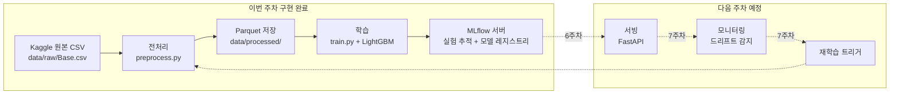
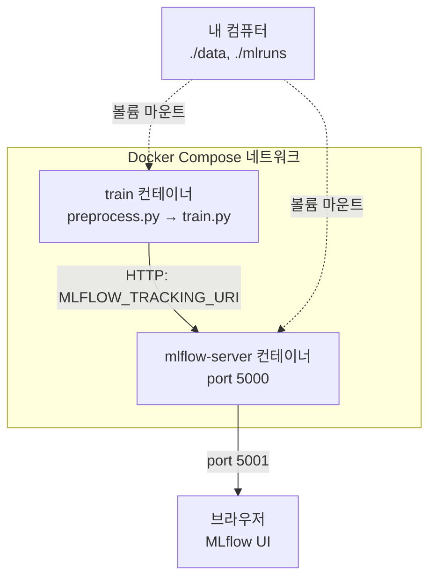

# BAF 사기 탐지 MLOps 미니 프로젝트

은행 계좌 개설 신청 데이터로 사기 여부를 예측하는 모델을 만들고, 그 과정을 재현 가능하게 관리하는 파이프라인을 구축한 5주차 미니 프로젝트입니다.

---

## 1. 문제 정의

은행에 새 계좌를 만들겠다는 신청이 들어올 때마다, 그 신청이 **사기인지 정상인지**를 자동으로 판별하는 모델을 만드는 것이 목표입니다.

- **데이터**: Feedzai가 NeurIPS 2022에 공개한 Bank Account Fraud(BAF) Dataset Suite 중 Base 버전
- **규모**: 100만 건의 계좌 개설 신청, 신청 건마다 30개의 정황 정보(소득, 나이, 기기 정보, 신청 속도 등)
- **타깃**: `fraud_bool` (0 = 정상, 1 = 사기)

### 실제 데이터 한 조각

| fraud_bool | income | customer_age | payment_type | device_os | session_length_in_minutes | month |
|---|---|---|---|---|---|---|
| 0 | 0.3 | 40 | AA | linux | 16.2 | 0 |
| 0 | 0.8 | 20 | AD | other | 3.4 | 0 |
| 0 | 0.8 | 40 | AB | windows | 22.7 | 0 |

### 왜 어려운 문제인가 — 극단적 불균형

```
전체 100만 건 중 사기는 11,029건 (1.1029%)
```

전부 "정상"이라고 찍기만 해도 98.9%가 맞는 상황입니다. 그래서 이 프로젝트의 핵심은 "정확도를 높이는 것"이 아니라, **희귀한 사기를 놓치지 않으면서 정상 고객을 과도하게 차단하지 않는 균형점**을 찾는 것입니다.

---

## 2. 평가 지표

**accuracy는 사용 금지**했습니다. 사기 비율이 1.1%뿐이라, 전부 정상이라고 예측해도 98.9%가 나와서 모델이 실제로 사기를 잡아내는지 전혀 알려주지 못하기 때문입니다.

| 지표 | 의미 | 왜 쓰는가 |
|---|---|---|
| **TPR@FPR5%** (주지표) | 정상 고객 오탐률을 5% 이내로 제한했을 때, 실제 사기 중 잡아내는 비율 | 은행이 감내 가능한 오탐 수준 아래에서의 실질 탐지력을 보여줌 |
| **AUPRC** (보조지표) | Precision-Recall 곡선 아래 면적 | 불균형 데이터에서 신뢰도 높은 종합 지표 |

### 베이스라인(LightGBM 기본값) 결과

| 지표 | 값 | 해석 |
|---|---|---|
| TPR@FPR5% | **0.5034** | 정상 고객 오탐 5% 이내에서, 실제 사기의 약 50%를 잡아냄 |
| AUPRC | **0.1541** | 무작위 예측(≈0.011) 대비 약 14배 높은 수준 |

> MLflow에 기록된 실제 화면 — `mlflow ui` 실행 후 `baf-fraud-baseline` 실험 → run 클릭 시 아래와 같은 Metrics/Parameters 표를 볼 수 있습니다. (스크린샷 삽입 위치)

---

## 3. 시간 분할 전략

8개월(0~7)치 데이터를 **무작위가 아니라 시간 순서대로** 잘랐습니다.

```
month:  0   1   2   3   4   5  |  6  |  7
       └──────── train ────────┘ valid  test(미사용)
```

| 구간 | 기간 | 행 수 | 사기 건수 | 사기 비율 |
|---|---|---|---|---|
| train | month 0~5 | 794,989 | 8,151 | 1.025% |
| valid | month 6 | 108,168 | 1,450 | 1.341% |
| test (미사용) | month 7 | 96,843 | 1,428 | 1.475% |

**왜 무작위 분할을 안 썼는가**: 실제 서비스는 "과거 데이터로 학습해서 미래를 예측"하는 상황입니다. 무작위로 섞으면 학습 데이터에 미래 정보가 섞여 들어가는 **데이터 누수**가 생기고, 검증 성능이 실제보다 부풀려 보이는 착시가 발생합니다.

검증(6월)·테스트(7월) 구간의 사기 비율이 학습 구간보다 높다는 걸 미리 확인했기 때문에, 검증 성능이 학습 때 기대보다 낮게 나오는 게 오히려 정상입니다 — 실제로 그 패턴대로 나왔습니다.

---

## 4. 아키텍처

데이터 → 학습 → 레지스트리 → 서빙 → 모니터링 → 재학습으로 이어지는 순환 구조로 설계했습니다.



### 지금 이 구조가 실제로 어떻게 돌아가는가 — Docker Compose



`train` 컨테이너는 실행되고 나면 종료되지만, `mlflow-server` 컨테이너는 계속 떠서 기록을 받아줍니다. 코드는 한 줄도 안 바꾸고, `MLFLOW_TRACKING_URI` 환경변수 하나로 "로컬 파일에 기록"과 "서버로 전송"을 전환합니다.

---

## 5. 툴스택

| 툴 | 역할 | 선택 이유 |
|---|---|---|
| Python + pandas | 데이터 전처리 | 표 형태 데이터를 다루는 사실상 표준 도구 |
| LightGBM | 베이스라인 모델 | 부스팅 계열이 불균형 데이터에 강함, 범주형 컬럼 네이티브 처리로 전처리 단순화 |
| Parquet | 전처리 결과 저장 | CSV와 달리 category dtype 등 스키마 보존, 용량도 더 작음 |
| MLflow | 실험 추적 + 모델 레지스트리 | params/metrics 자동 기록, 모델 아티팩트 저장 → 서빙 단계 재사용 |
| Docker / Docker Compose | 환경 재현, 컨테이너 연결 | OS·시스템 라이브러리까지 통째로 포장해 재현성 확보, 역할이 다른 컨테이너(학습/서버) 분리 |
| venv + requirements.txt | 로컬 환경 격리 | 프로젝트 간 패키지 충돌 방지, Docker 이미지 빌드에 그대로 재사용 |
| PyYAML (conf/config.yaml) | 설정과 코드 분리 | 값 변경 시 코드 수정 불필요 |
| pytest | 전처리 로직 검증 | 규약대로 동작하는지 자동 검증, CI/CD 재사용 예정 |

**선택 기준**: "재현 가능하고, 검증 가능한가." 하나로 요약됩니다.

---

## 6. 구현 결과

### 필수 구현 체크리스트

| 항목 | 상태 |
|---|---|
| preprocess / train / evaluate 3단계 스크립트 분리 (노트북 X) | ✅ |
| Docker로 학습 1회 실행 성공 | ✅ |
| MLflow run 1건 이상, params(하이퍼파라미터·random_state·시간분할) + metrics 기록 | ✅ |

### 선택 구현 진행 현황

| 항목 | 상태 | 비고 |
|---|---|---|
| pytest 단위 테스트 | ✅ 14개 통과 | 결측 변환·컬럼 드롭·시간분할 겹침 검증 |
| conf/ yaml 분리 | ✅ | 리팩터링 전후 pytest 통과로 안전성 확인 |
| Docker Compose | ✅ | 학습 컨테이너 + MLflow 서버 컨테이너 분리 |
| EDA 노트북 | ⬜ | 예정 |
| DVC | ⬜ | 예정 |

### pytest 실행 결과

```
$ pytest tests/ -v
tests/test_data_quality.py::test_fraud_bool_is_binary PASSED
tests/test_data_quality.py::test_income_is_normalized_0_to_1 PASSED
tests/test_data_quality.py::test_month_within_train_range PASSED
tests/test_data_quality.py::test_categorical_columns_have_expected_dtype PASSED
tests/test_data_quality.py::test_device_fraud_count_dropped PASSED
tests/test_data_quality.py::test_credit_risk_score_can_be_negative PASSED
tests/test_data_quality.py::test_neg1_missing_markers_are_gone PASSED
tests/test_preprocess.py::test_drop_uninformative_columns_removes_device_fraud_count PASSED
tests/test_preprocess.py::test_neg1_columns_become_nan PASSED
tests/test_preprocess.py::test_intended_balcon_amount_negative_becomes_nan PASSED
tests/test_preprocess.py::test_credit_risk_score_and_velocity_6h_negatives_preserved PASSED
tests/test_preprocess.py::test_categorical_columns_get_category_dtype PASSED
tests/test_preprocess.py::test_split_by_month_no_overlap_and_full_coverage PASSED
tests/test_preprocess.py::test_split_by_month_boundaries_are_correct PASSED
============================== 14 passed in 0.73s ===============================
```

**일부러 버그를 심어서 테스트를 검증한 과정**: `split_by_month`에 "5월이 train과 valid 양쪽에 겹치는" 버그를 심었더니, 처음엔 테스트 데이터에 5월 값이 없어서 못 잡았습니다. 테스트 데이터에 경계값(5월)을 추가하고 나서야 정확히 잡아냈습니다 — 테스트 로직뿐 아니라 **테스트 데이터가 실제 경계 상황을 커버하는지**도 중요하다는 걸 확인했습니다.

### 프로젝트 구조

```
MLOps/
├── Dockerfile
├── .dockerignore
├── docker-compose.yml
├── conftest.py
├── requirements.txt
├── conf/
│   └── config.yaml          # 경로·전처리 규칙·하이퍼파라미터·시간분할 설정
├── data/
│   ├── raw/Base.csv
│   └── processed/{train,valid,test}.parquet
├── src/
│   ├── config.py             # yaml 로더
│   ├── preprocess.py
│   ├── train.py
│   └── evaluate.py
├── tests/
│   ├── test_preprocess.py    # 함수 단위 테스트 (가짜 미니 데이터)
│   └── test_data_quality.py  # 실제 전처리 결과물 값 범위 검증
└── docs/
    └── presentation.md
```

---

## 7. 전처리 규칙 요약

원본 CSV를 그대로 학습에 쓸 수 없는 이유와 처리 방법을 정리했습니다.

| 문제 | 예시 | 처리 |
|---|---|---|
| 정보량 없는 컬럼 | `device_fraud_count`가 전체 100만 행 모두 0 | 컬럼 삭제 |
| 가짜 결측치 (`-1`) | `prev_address_months_count = -1` (거주 개월 수가 음수일 수 없음) | -1 → NaN (5개 컬럼, 최대 71.29%) |
| 규칙이 다른 결측치 | `intended_balcon_amount`는 음수 전체가 결측 (정확히 -1인 값은 0건) | `< 0` → NaN |
| 진짜 음수값 | `credit_risk_score`, `velocity_6h`의 음수는 정상 신호 | 그대로 유지 |
| 문자열 컬럼 | `payment_type`, `device_os` 등 5개, 익명 코드라 해석 불가 | `category` dtype → LightGBM 네이티브 처리 |

---

## 8. 다음 단계

- 선택 과제 마무리: EDA 노트북(피처 분포, 월별 사기율 변화), DVC(데이터 버전 관리)
- 6주차: FastAPI 서빙 — MLflow 모델의 category 컬럼 입력 스키마 설계
- 7주차: 드리프트 감지 및 자동 재학습 루프

---

## 부록: 예상 질문

**Q. 다른 팀원들과 결과가 똑같지 않나요?**
필수 구현(전처리 규칙·시간분할·LightGBM 기본값·random_state=42)은 고정 조건이라 baseline 수치는 동일한 게 정상입니다. 차이는 툴스택 선택, 선택 과제 범위, 추가 모델 실험에서 납니다.

**Q. Docker Compose는 Docker랑 뭐가 다른가요?**
Docker는 컨테이너 하나를 어떻게 만들지 정의(Dockerfile)하고, Compose는 여러 컨테이너를 어떻게 함께 띄우고 연결할지 정의(docker-compose.yml)합니다.

**Q. pytest가 실제로 버그를 잡는지 어떻게 확인했나요?**
위 6번 항목 참고 — 일부러 버그를 심고, 테스트 데이터의 커버리지 부족까지 함께 발견하고 고쳤습니다.
